# Amazing Robot Battle
Game Design Document

## Autores

Arthur Vieira, NUSP: 6482041

Carlos Molano: NUSP: 10950510

Guilherme Yambanis: NUSP:  8041265

Luiz Girotto, NUSP: 8941189

Mathias Menck, NUSP: 4343470

# Índice
1. Índice
2. Game Design
	* Resumo
	* Gameplay
	* Mindset
3. Técnico
	* Telas
	* Controles
	* Mecânicas
4. Design da Fase
	* Temas
		* Ambiência
		* Objetos
			* Ambiente
			* Interativos
		* Desafios
	* Game Flow
5. Desenvolvimento
	* Classes Abstratas
	* Classes Derivadas
6. Gráficos
	* Estilo
	* Gráficos necessários
7. Música e Sons
	* Estilo
	* Sons necessários
	* Música necessária
8. Cronograma

# Game Design

## Resumo
> Batalha de Robôs: Dois robôs se enfrentam em uma arena, existindo duas condições de vitória: Empurrar o adversário para fora da arena ou deixar seu hp em 0.

## Gameplay
> O jogo baseia-se nos famosos brawlers 2D mas com características únicas, notadamente, personagens customizáveis, permitindo muita variabilidade de habilidade e a mecânica de _sumô_, com a eliminação por sair da área de combate e a inexistência da capacidade de saltar.

## Mindset
> A intenção do jogo é ser frenético, com partidas muito rápidas. A penalidade por saída da área de combate exige enfrentamento entre os jogadores, fazendo com que o embate seja inevitável e exista pouco espaço para deliberações. Além disso, ênfase especial foi dada na montagem dos robôs, permitindo que, aliada com tempo curto de partida, muitos batalhas em sequência ocorram, baseadas na variabilidade de poderes e na sensação de _revanche_ criada entre os competidores.

# Técnico
## Telas

## 1. Menu de seleção de peças

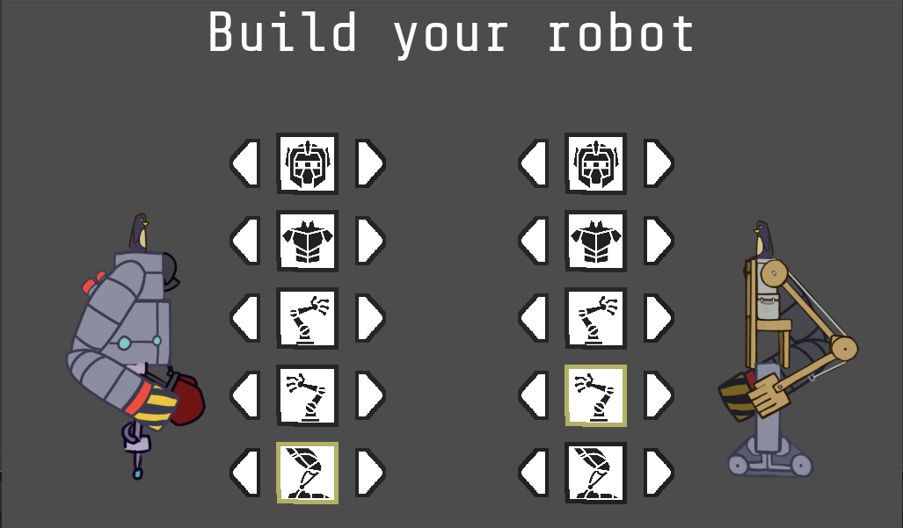

## 2. Combate

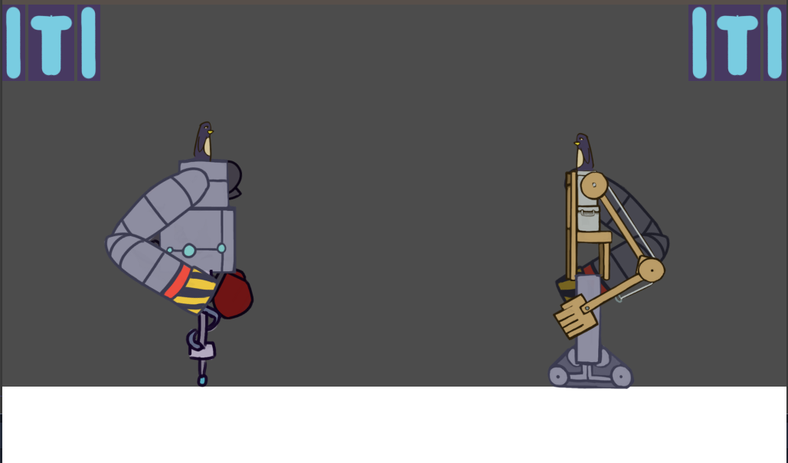

## Controles
> Os controles possíveis para os jogadores são:

1. Movimentação do robô
	* esquerda
	* direita

2. Atacar
	* braço esquerdo
	* braço direito

3. Defender

## Mecânicas
> Uma das partes mais interessantes do jogo se dá antes mesmo da batalha: a seleção das peças.
Como cada peça possui atributos diferentes, a montagem do robô pode ser visto como um jogo em si, já que é possível definir estratégias diferentes baseadas nas peças que são escolhidas e até mesmo existir um _meta game_ entre os jogadores, para tentar contrabalancear as escolhas do adversário.

# Desenvolvimento
## Classes Abstratas
BasePhysics

BasePlayer

BaseEnemy

BaseObject

BaseObstacle

BaseInteractable

(example)

## Classes Derivadas
BasePlayer

PlayerMain

PlayerUnlockable

BaseEnemy

EnemyWolf

EnemyGoblin

EnemyGuard (may drop key)

EnemyGiantRat

EnemyPrisoner

BaseObject

ObjectRock (pick-up-able, throwable)

ObjectChest (pick-up-able, throwable, spits gold coins with key)

ObjectGoldCoin (cha-ching!)

ObjectKey (pick-up-able, throwable)

BaseObstacle

ObstacleWindow (destroyed with rock)

ObstacleWall

ObstacleGate (watches to see if certain buttons are pressed)

BaseInteractable

InteractableButton

(example)

# Gráficos
## Estilo
O estilo escolhido foi cartoonizado. Isso permitiu a criação de _sprites_ mais facilmente e também foi útil para atenuar um possível desconforto do jogador com o combate.

## Gráficos Necessários

## 1. Cabeças

   * Modelo 1

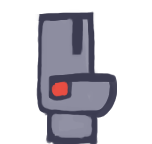

   * Modelo 2

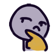

   * Modelo 3

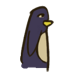

## 2. Torsos

   * Modelo 1

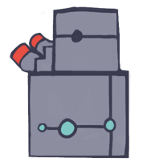

   * Modelo 2

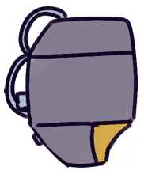

   * Modelo 3

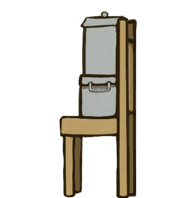

## 3. Pernas

   * Modelo 1

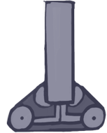

   * Modelo 2

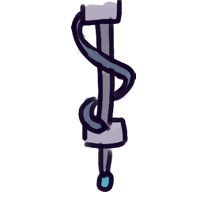

   * Modelo 3

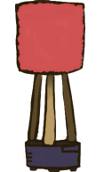

## 4. Braços

   * Modelo 1

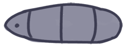

   * Modelo 2

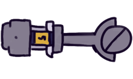

   * Modelo 3

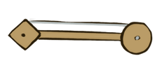

# Música e Sons
## Estilo
> Os sons implementados foram básicos, a fim de criar um experiência mais sinestésica para o jogador. O som no menu de seleção e ao acertar o golpe são importantes, para passar uma maior idéia de ação ao jogador.

## Sons Necessários
_plop_ => menu de seleção

_player ready_ => voice over indicando status do jogador no menu de seleção

_clang_ => efeito ao acertar ataque

_fight_ => voice over para indicar início da partida

_winner_ => efeito para indicar fim da partida

# Cronograma
(what is a schedule, i don’t even. list is good enough, right? if not add some dates i guess)

develop base classes
base entity
base player
base enemy
base block
base app state
game world
menu world
develop player and basic block classes
physics / collisions
find some smooth controls/physics
develop other derived classes
blocks
moving
falling
breaking
cloud
enemies
soldier
rat
etc.
design levels
introduce motion/jumping
introduce throwing
mind the pacing, let the player play between lessons
design sounds
design music
(example)

